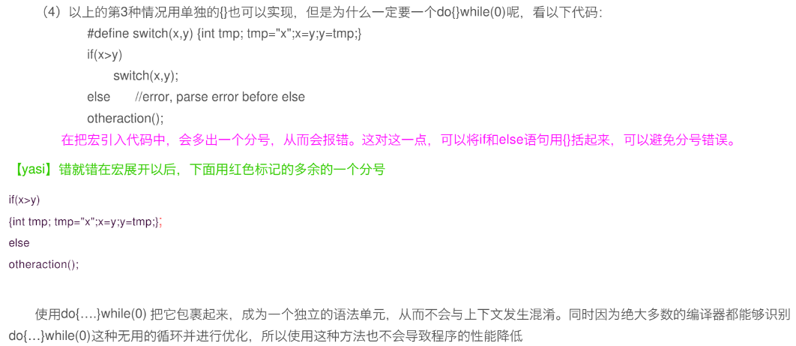

```text
修改记录：
V0.0.0  创建日期：2022.10.31
V0.0.1  增加日期：2022.10.31 定位程序运行时的错误
```

# **attribute**之 section 详解：

https://blog.csdn.net/seven_feifei/article/details/95947358

# C 语言---一些特殊的用法（函数调度表、变量附加属性）

https://blog.csdn.net/lsllll44/article/details/111711344
https://gitee.com/testzyh/notes/blob/master/%E8%BD%AC%E8%BD%BD%E4%B8%8E%E6%94%B6%E8%97%8F/%E6%96%87/Computer%20Systems%20A%20Programmer%E2%80%99s%20Perspective.md#71-%E7%BC%96%E8%AF%91%E5%99%A8%E9%A9%B1%E5%8A%A8

# 一、定位程序运行时的错误

参考： https://blog.csdn.net/jackchoise030/article/details/88560912
参考：https://blog.csdn.net/qingzhuyuxian/article/details/80968135
C/C++提供了三个宏**FUNCTION**,*FILE*和*LINE*定位程序运行时的错误。程序预编译时预编译器将用所在的函数名，文件名和行号替换。

# 宏定义

## **FUNCTION**

另外 gcc 还支持**func**,它指示所在的函数，但是这个关键字不被 windows 下的 vc6.0 支持

```C
#include <stdio.h>
void main()
{
printf("this is print by function %s\n",__func__);
}
```

## **FILE**

C 语言中的**FILE**用以指示本行语句所在源文件的文件名

```C
#include <stdio.h>
int main()
{
printf("%s\n",__FILE__);
}
```

## **LINE**

在 linux 用 gcc 编译，在 windows 的 vc6.0 下编译都可以通过，
可以通过语句#line 来重新设定**LINE**的值

```C
#include <stdio.h>


#line 200  //指定下一行的__LINE__为200
main()
{
printf("%d\n",__LINE__);
printf("%d\n",__LINE__);
printf("%d\n",__LINE__);
};
```

# 预编译指令

在 C/C++中，在使用预编译指令#include 的时候，为了防止重复引用造成二义性，通常有两种方式—— 第一种是#ifndef 指令防止代码块重复引用，第二种就是#pragma once 指令，在想要保护的文件开头写入。
参考：https://blog.csdn.net/DaMercy/article/details/109078274?
https://baijiahao.baidu.com/s?id=1729374634493915166&wfr=spider&for=pc

## #pragma once

并不是 C++的原生语法,而是编译器的一种支持,所以并不是所有的编译器都能够支持。#ifndef 则为 C++的标准。
#pragma once 一般由编译器提供保证：同一个文件不会被包含多次。这里所说的”同一个文件”是指物理上的一个文件，而不是指内容相同的两个文件。无法对一个头文件中的一段代码作#pragma once 声明，而只能针对文件。此方式不会出现宏名碰撞引发的奇怪问题，大型项目的编译速度也因此提供了一些。缺点是如果某个头文件有多份拷贝，此方法不能保证它们不被重复包含。在 C/C++中，#pragma once 是一个非标准但是被广泛支持的方式。
#pragma once 方式产生于#ifndef 之后。#ifndef 方式受 C/C++语言标准的支持，不受编译器的任何限制；而#pragma once 方式有些编译器不支持(较老编译器不支持，如 GCC 3.4 版本之前不支持#pragmaonce)，兼容性不够好。#ifndef 可以针对一个文件中的部分代码，而#pragma once 只能针对整个文件。相对而言，#ifndef 更加灵活，兼容性好，#pragma once 操作简单，效率高。

## #ifndef

#ifndef 方式是 C/C++语言的标准支持，也是比较常用的方式，#ifndef 的方式依赖于自定义的宏名（例中的\_CODE_BLOCK）不能冲突，它不光可以保证同一份文件不会被包含两次，也能够保证不同文件完全相同的内容不会被包含两次。但，同样的，如果自定义的宏名不小心“重名”了，两份不同的文件使用同一个宏名进行#ifndef，那么会导致编译器找不到声明的情况（被编译器判定为重定义而屏蔽了）。
此外，由于编译器每次都需要打开头文件才能判定是否有重复定义，因此在编译大型项目时，#ifndef 会使得编译时间相对较长，因此一些编译器逐渐开始支持#pragma once 的方式（Visual Studio 2017 新建头文件会自带#pragma once 指令）。

# 二、 #、## 连接 字符串/代码

参考：https://wenku.baidu.com/view/96770f4b1db91a37f111f18583d049649b660e0d.html
https://baijiahao.baidu.com/s?id=1729374634493915166&wfr=spider&for=pc

## 1.#

When you put a # before an argument in a preprocessor macro, the preprocessor turns that argument into a character array.
在一个宏中的参数前面使用一个#，预处理器会把这个参数转换为一个字符数组
简化理解: #是“字符串化"的意思，出现在宏定义中的#是把跟在后面的参数转换成一个字符串

```C
#define ERROR_LOG(module) fprintf(stderr," error: "#module""n")

// ERROR_LOG("add"); 转换为 fprintf(stderr, "error: "add"\n");
// ERROR_LOG(devied =O); 转换为 fprintf(stderr," error: devied=0\n");
```

## 2.##

“##"是一种分隔连接方式，它的作用是先分隔，然后进行强制连接。
在普通的宏定义中，预处理器一般把空格解释成分段标志，对于每一段和前面比较，相同的就被替换。但是这样做的结果是，被替换段之间存在一些空格。如果我们不希望出现这些空格，就可以通过添加一些#来替代空格。
三、宏定义 do{}while(0) 的作用
(1)空的宏定义避免 warning:

```C
#define foo() do{}while(0)
```

(2)存在一个独立的 block，可以用来进行变量定义，进行比较复杂的实现。
(3)如果出现在判断语句过后的宏,这样可以保证作为一个整体来是实现

```C
#define foo(x) \
action1();
action2();
//在以下情况下:
if(NULL== pPointer)
foo();
//就会出现 action1 和 action2 不会同时被执行的情况,而这显然不是程序设计的目的。
```


