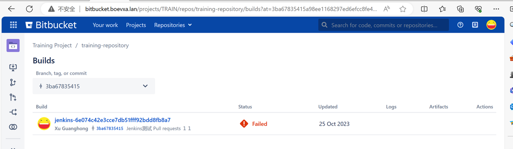
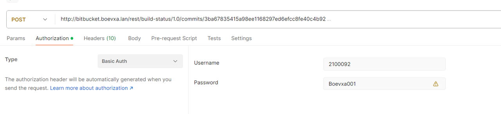
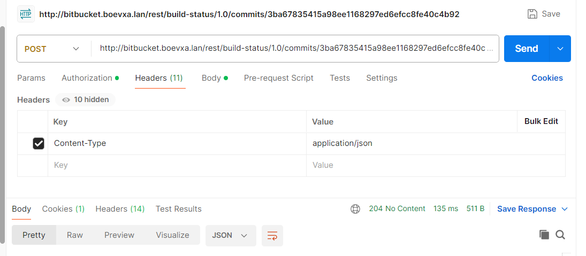
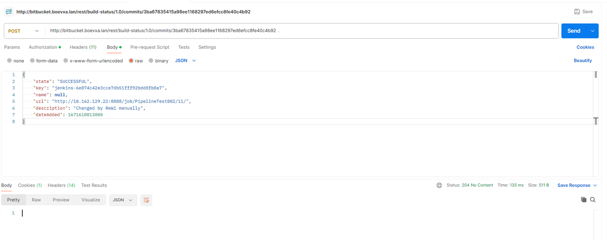
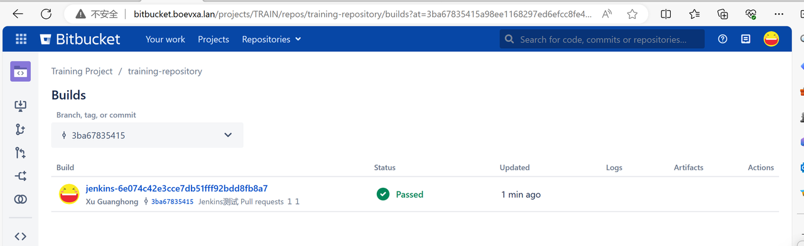
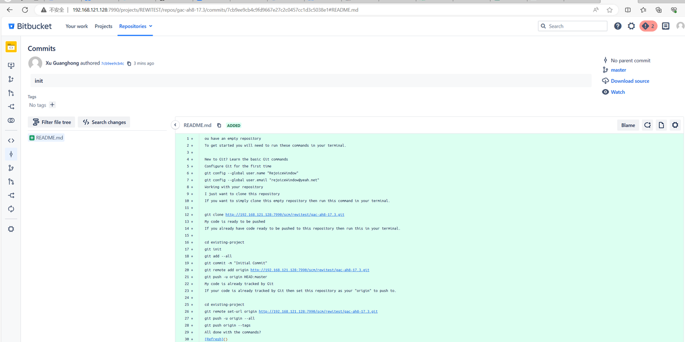
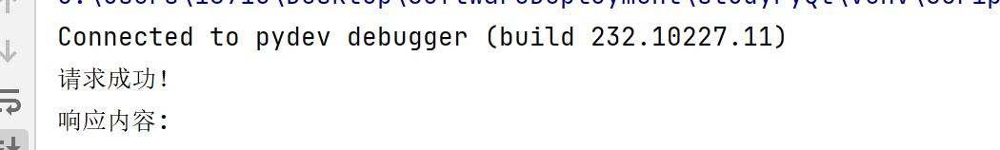
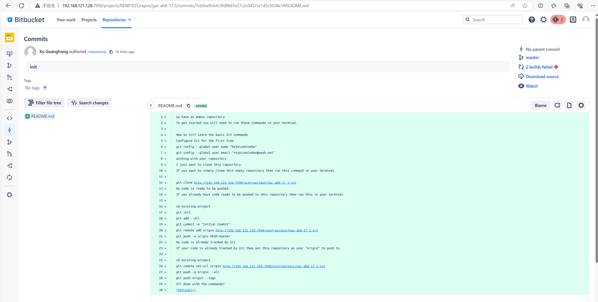
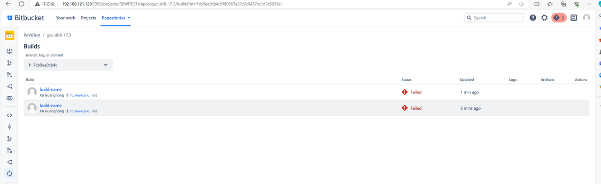

## 目录

[[toc]]

## 文档

- https://confluence.atlassian.com/bitbucketserver/push-logs-998882984.html

## 官方文档

- https://developer.atlassian.com/server/bitbucket/how-tos/updating-build-status-for-commits/
- https://developer.atlassian.com/server/bitbucket/rest/v818/api-group-builds-and-deployments/#api-required-builds-latest-projects-projectkey-repos-repositoryslug-condition-id-put
- https://docs.atlassian.com/bitbucket-server/rest/7.14.0/bitbucket-build-rest.html
- https://docs.atlassian.com/bitbucket-server/rest/7.19.0-rc1/bitbucket-rest.html#idp228
- https://developer.atlassian.com/server/bitbucket/reference/api-changelog/#bitbucket-data-center-8-18

---

- https://zhuanlan.zhihu.com/p/106946573
- https://my.atlassian.com/products/index?sen=20124584&evalId=20124584&eval=true#license_20124584

```shell
sudo docker pull docker.io/atlassian/bitbucket-server
sudo docker run -v bitbucket:/var/atlassian/application-data/bitbucket --name="bitbucket" -d -p 7990:7990 -p 7999:7999 docker.io/atlassian/bitbucket-server
```

## 查看



```json
{
  "size": 1,
  "limit": 25,
  "isLastPage": true,
  "values": [
    {
      "state": "FAILED",
      "key": "jenkins-6e074c42e3cce7db51fff92bdd8fb8a7",
      "name": null,
      "url": "http://10.162.128.223:8888/job/BitbucketAutoBuild001/12/",
      "description": null,
      "dateAdded": 1698204441288
    }
  ],
  "start": 0
}
```

```python
# -*- coding: utf-8 -*-
# bitbucketViewingBuildResults.py

from requests.auth import HTTPBasicAuth
import requests
import json

########################################################################################################################
bitbucketBaseUrl = "192.168.121.128:7990"
commitHash = "7cb9ee9cb4c9fd9667e27c2c0457cc1d3c5038e1"
userAuth = HTTPBasicAuth("ReWi", "xu1314")
########################################################################################################################

"""
Viewing build results
"""

url = f"http://{bitbucketBaseUrl}/rest/build-status/1.0/commits/{commitHash}"

headers = {
    "Content-Type": "application/json"
}

# 将数据转换为JSON格式
# json_data = json.dumps(data)

response = requests.get(
    url=url,
    headers=headers,
    auth=userAuth,
)

# 检查响应
if response.status_code == 200:
    print('请求成功！')
    print('响应内容:', response.text)
    print(json.dumps(json.loads(response.text), sort_keys=True, indent=4, separators=(",", ": ")))
else:
    print('请求失败:', response.status_code)
    print(response.text)
```

## 更新



- 时间戳转换工具： https://tool.lu/timestamp/

```json
{
  "state": "SUCCESSFUL",
  "key": "jenkins-6e074c42e3cce7db51fff92bdd8fb8a7",
  "name": null,
  "url": "http://10.162.129.22:8888/job/PipelineTest002/11/",
  "description": "Changed by ReWi manually",
  "dateAdded": 1671618813000
}
```


时间改不了：

Sure this manual process so it makes sense to automate the whole procedure. Well as at my employeer we mostly work on Windows machines, I’ve made a small powershell script.

```python
# -*- coding: utf-8 -*-
# bitbucketUpdatBuildResult.py

from requests.auth import HTTPBasicAuth
import requests
import json

########################################################################################################################
bitbucketBaseUrl = "192.168.121.128:7990"
commitHash = "7cb9ee9cb4c9fd9667e27c2c0457cc1d3c5038e1"
userAuth = HTTPBasicAuth("ReWi", "xu1314")
########################################################################################################################

"""
Adding a build result to a commit
"""

# To associate a build result with a particular commit, you need to POST a JSON object to the build status REST resource at:

'''
https://<bitbucket-base-url>/rest/build-status/1.0/commits/<commit-hash>
'''

url = f"http://{bitbucketBaseUrl}/rest/build-status/1.0/commits/{commitHash}"

headers = {
"Content-Type": "application/json"
}

data = {
"dateAdded": 1671618813000,
"description": "build-description",
"key": "build-key-ReWiTest001",
"name": "build-name",
"state": "INPROGRESS",
"url": "https://www.baidu.com"
}

# 将数据转换为 JSON 格式

# json_data = json.dumps(data)

response = requests.post(
url=url,
headers=headers,
auth=userAuth,
json=data, # 使用 json 参数而不是 data 参数
)

# 检查响应

if response.status_code == 204:
print('请求成功！')
print('响应内容:', response.text)
else:
print('请求失败:', response.status_code)
print(response.text)

# print(json.dumps(json.loads(response.text), sort_keys=True, indent=4, separators=(",", ": ")))
```

## 新增：

1. 获取参数
   http://192.168.121.128:7990/projects/REWITEST/repos/gac-ah8-17.3/commits/7cb9ee9cb4c9fd9667e27c2c0457cc1d3c5038e1#README.md



```python
# -*- coding: utf-8 -*-
# bitbucketAddBuildResult.py

from requests.auth import HTTPBasicAuth
import requests
import json

########################################################################################################################
bitbucketBaseUrl = "192.168.121.128:7990"
commitHash = "7cb9ee9cb4c9fd9667e27c2c0457cc1d3c5038e1"
userAuth = HTTPBasicAuth("ReWi", "xu1314")
########################################################################################################################

"""
Adding a build result to a commit

"state": "<INPROGRESS|SUCCESSFUL|FAILED>",
"""

# To associate a build result with a particular commit, you need to POST a JSON object to the build status REST resource at:

'''
https://<bitbucket-base-url>/rest/build-status/1.0/commits/<commit-hash>
'''

url = f"http://{bitbucketBaseUrl}/rest/build-status/1.0/commits/{commitHash}"

headers = {
"Content-Type": "application/json"
}

data = {
"state": "FAILED",
"key": "build-key-ReWiTest002",
"name": "build-name",
"url": "https://www.baidu.com",
"description": "build-description"
}

# 将数据转换为 JSON 格式

# json_data = json.dumps(data)

response = requests.post(
url=url,
headers=headers,
auth=userAuth,
json=data, # 使用 json 参数而不是 data 参数
)

# 检查响应

if response.status_code == 204:
print('请求成功！')
print('响应内容:', response.text)
else:
print('请求失败:', response.status_code)
print(response.text)

# print(json.dumps(json.loads(response.text), sort_keys=True, indent=4, separators=(",", ": ")))
```

2. 效果：
   
   
   

## 数据库迁移

```shell
# 进入postgres容器
sudo docker exec -it postgres bash
# 将当前root切换成postgres
su postgres
# 输入用户名，密码再命令执行完后，再根据提示输入
psql -U postgres -W
```

- https://optimizory.atlassian.net/wiki/spaces/rmsis/pages/284849/Database+Setup

```shell
CREATE DATABASE bitbucket WITH ENCODING 'UNICODE';
createdb -E UNICODE bitbucket
```

- https://www.runoob.com/postgresql/postgresql-drop-database.html

```shell
DROP DATABASE bitbucket;
# dropdb rmsis
```

- https://www.runoob.com/postgresql/postgresql-privileges.html

```shell
# 创建一个用户：
CREATE USER admin WITH PASSWORD 'xu1314';
# 删除用户
DROP USER admin;
```

```shell
GRANT ALL PRIVILEGES ON DATABASE bitbucket TO admin;
```
