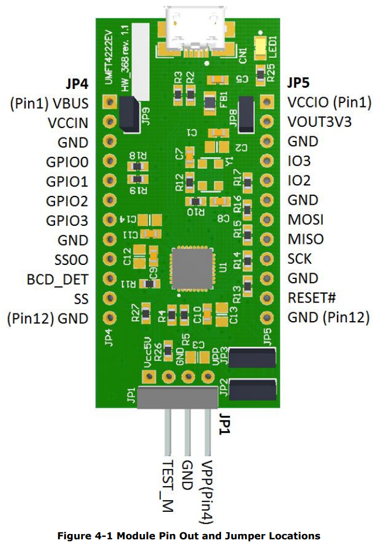
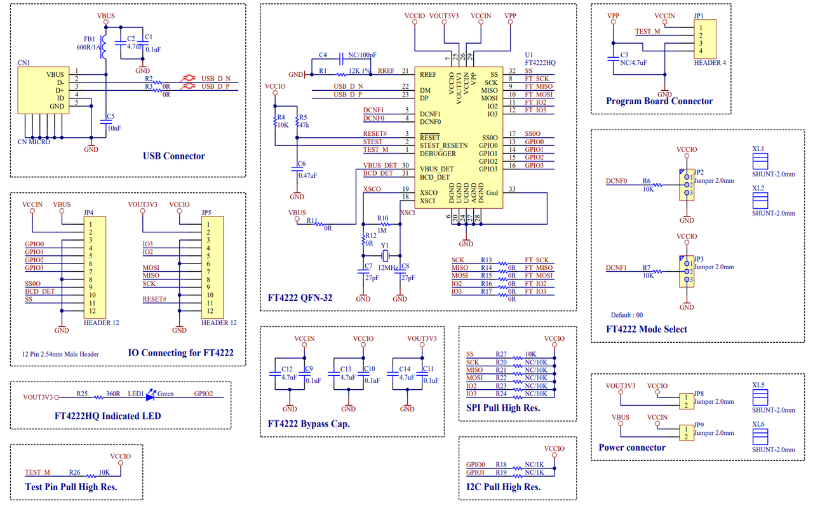

## 官网

- https://ftdichip.com/products/ft4222h/
- https://ftdichip.com/software-examples/ft4222h-software-examples/
- https://ftdichip.com/wp-content/uploads/2020/07/DS_UMFT4222EV.pdf
- https://ftdichip.com/wp-content/uploads/2023/10/AN_329_User_Guide_for_LibFT4222-v1.7.pdf

## Python 开发

- https://pypi.org/project/ft4222/

## C 开发

- https://github.com/Flynn-zfl/AutoDebug/tree/master/I2C
- https://github.com/letgo0007/ft4222h_i2ctool/blob/master/fti2c.c

## PCB

```text
GND：地线
GPIO0：SCL
GPIO1：SDA
```



## 原理图

```text
文档:DS_UMFT4222EV.pdf
```


有没有免费开源，且支持跨平台的 C++语言的 GUI 框架

```text
是的，有几个免费、开源且支持跨平台的C++ GUI 框架。以下是其中一些：

1. **Qt：**
   - **描述：** Qt 是一个跨平台的C++应用程序开发框架，支持Windows、Linux、macOS等操作系统。它提供了丰富的功能，包括GUI开发、网络编程、数据库操作等。
   - **许可：** 开源版本使用LGPL协议。

2. **GTK：**
   - **描述：** GTK（GIMP Toolkit）是用于创建图形用户界面的开源工具包，支持多个平台，包括Windows、Linux、macOS。
   - **许可：** LGPL协议。

3. **wxWidgets：**
   - **描述：** wxWidgets是一个C++库，可用于创建跨平台的GUI应用程序。它支持多个操作系统，包括Windows、Linux、macOS。
   - **许可：** wxWindows许可证，类似LGPL。

4. **FLTK（快速、轻量级的GUI工具包）：**
   - **描述：** FLTK是一个小型而高效的GUI工具包，支持Windows、Linux、macOS等。它专注于快速、轻量级的应用程序。
   - **许可：** LGPL协议。

5. **JUCE：**
   - **描述：** JUCE是一个用于跨平台音频、图形和应用程序开发的C++框架。它支持Windows、Linux、macOS以及移动平台。
   - **许可：** JUCE自家提供的许可证。

6. **Dear ImGui：**
   - **描述：** Dear ImGui是一个即时模式图形用户界面库，专注于提供简单而强大的API。它可以集成到现有的应用程序中。
   - **许可：** MIT许可证。

这些框架各有其特点，你可以根据项目的需求、开发者喜好以及框架的社区支持来选择最适合你的框架。
```

## 树莓派

- 使用 FT4222：https://blog.csdn.net/luo58614013/article/details/136454406
