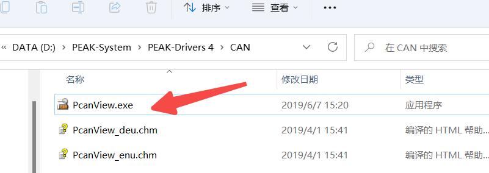
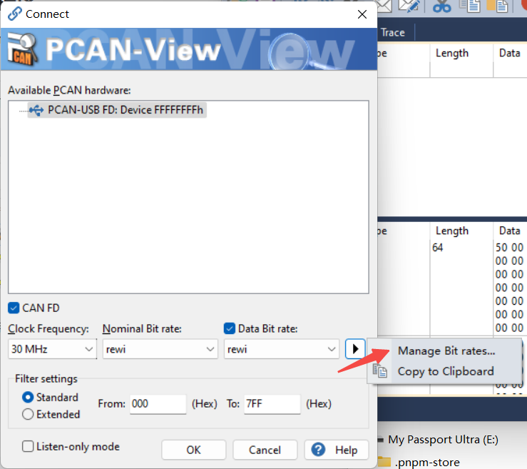
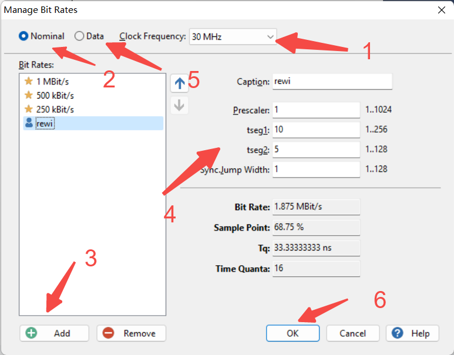

软件使用说明参考：

- https://python-can.readthedocs.io/en/stable/installation.html
- https://max.book118.com/html/2021/1208/6210043243004111.shtm

# 1. 安装驱动程序

- https://www.peak-system.com/Downloads.76.0.html?&L=1

# 2. 在安装目录下打开软件 PcanView

# 3. 配置自定义波特率

连接之后点击相应按钮就可以观察数据了
